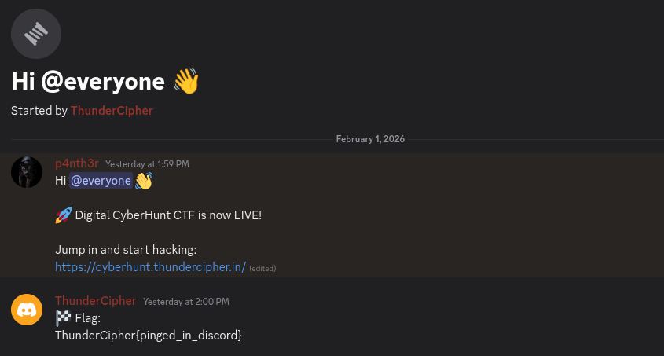

#  CTF Writeup — Discord Flag Hunt

## Challenge Information

- **Challenge Name:** Discord  
- **Category:** Misc  
- **Difficulty:** Easy  
- **Hint Provided:** *All communication is being done on the Discord server.*  
- **Invite Link:**  
https://discord.com/invite/ctKrs4UeBD

---

## Challenge Description

This is a Miscellaneous category challenge where the participant must find the flag through external communication channels.  
The hint strongly suggests that the flag is not hidden in files or encoded text, but instead directly available on the Discord server.

---

## Solution Walkthrough

### Step 1: Understand the Hint

The challenge provides the hint:

> All communication is being done on the Discord server.

This means the flag is likely posted somewhere in the Discord community channels.

---

### Step 2: Open the Discord Invite Link

The given invite link is:

https://discord.com/invite/ctKrs4UeBD

Opening this link redirects to the official **ThunderCipher Discord server**.

---

### Step 3: Join the ThunderCipher Server

After accepting the invite, the user successfully joins the server.

---

###  Step 4: Explore Available Channels

Inside the server, multiple channels are visible.  
The challenge name and simplicity suggest that the flag might be placed in the most common channel:

- `#general`



---

###  Step 5: Find the Flag

Upon entering the **#general** channel, the flag is provided directly as a message in plain text.

---

## Flag

The flag obtained from the Discord server is:

```
ThunderCipher{pinged_in_discord}
```
