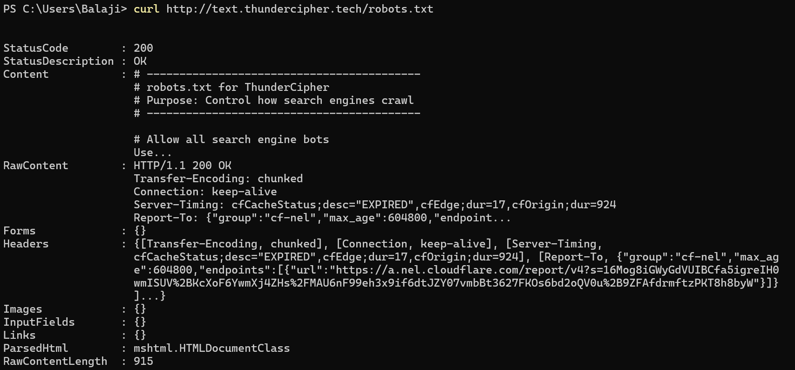

Challenge: Source of Thunder

Category: Web
Difficulty: Easy
Goal: Recover the hidden flag

Challenge URL:
https://source.thundercipher.tech/

🧠 Challenge Description

Modern websites rely on clean design and dynamic behavior.
But sometimes, developers leave too much inside the source.

The goal of this challenge is to inspect the website source code and find the hidden flag.

🔍 Initial Observation

Opening the website normally in a browser resulted in a security block page due to antivirus protection (McAfee WebAdvisor).
This meant the actual website source was not visible in the browser.

To bypass this issue, the website was accessed directly using command-line tools.

🌐 Fetching the Real Website Source

Using curl / Invoke-WebRequest, the real HTML content of the page was retrieved successfully.

curl https://source.thundercipher.tech/

The response showed a basic HTML page titled Thunder Portal, indicating this was the real challenge page.

🧩 Inspecting the HTML Source

Saving and viewing the full HTML revealed the following hidden comment:

<!-- FLAG PART 1 -->

<!-- ThunderCipher{source_code_ -->

This confirmed that the flag was split into multiple parts, and only the first part was present in the HTML source.

🎨 Inspecting the CSS File

The HTML referenced an external CSS file:

<link rel="stylesheet" href="style.css">

Fetching style.css revealed an important comment:

/* Designers leave notes too */
/* hidden_in_ */

This comment clearly contained the second part of the flag.

📜 Inspecting the JavaScript File

The HTML also referenced an external JavaScript file:

Upon fetching app.js, the following code was found:

// Final piece
const flagEnd = "plain_sight}";

This contained the final part of the flag, completing the puzzle.

🏁 Reconstructing the Flag

Combining all three parts in the correct order:

From HTML

ThunderCipher{source_code_

From CSS

hidden_in_

From JavaScript

plain_sight}

✅ Final Flag
ThunderCipher{source_code_hidden_in_plain_sight}